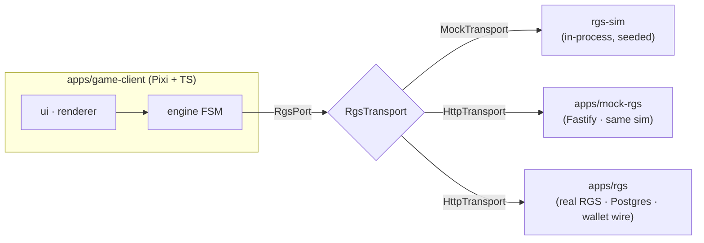
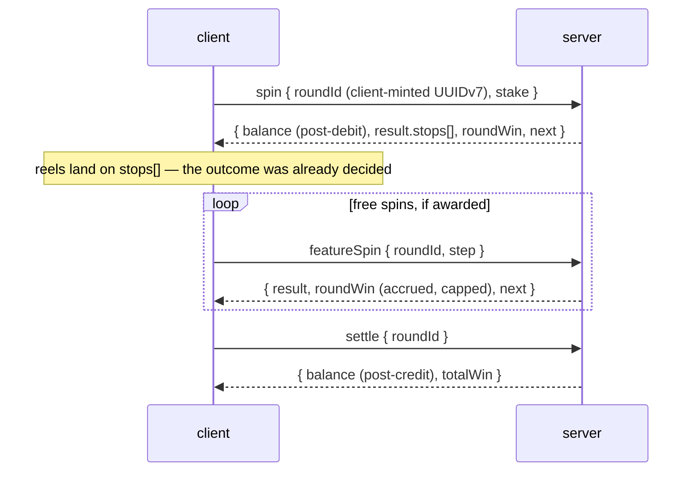

# Aurora Reels — a server-authoritative slot client

<!-- C8: the GIF of a big-win sequence lands here the day the demo is hosted.
     Record it from the deployed page: force MAX_WIN from the DEV panel, capture the count-up. -->

> **Live demo: coming with the C8 deploy.** Until the URL exists, the demo is one command away:
>
> ```bash
> docker build -f apps/mock-rgs/Dockerfile -t slot-demo . && docker run --rm -p 8787:8787 slot-demo
> ```
>
> Open <http://localhost:8787/>, press **DEV** in the corner, force a **MAX_WIN** — and watch the
> client *present* an outcome it had no part in deciding. `?lang=ru` switches the language.

**18+ · Demo · Play money only — no real money, no payments, no crypto.**

## The one decision everything hangs on

**The client never decides outcomes. It presents an outcome the server already committed to.**
Every spin is answered with `stops[]` — the authoritative reel positions — and the money after the
operation. The client lands the reels on those stops, lights the paylines the server named, and
displays the balance the server sent. It ships the paytable, because it needs one to highlight
wins and sequence animations — but in dev builds it *re-evaluates* the server's grid and screams
into telemetry if the win set disagrees. Presentation logic, not authority: there is no code path
in which the client invents a number a player could be paid.

## Architecture — the transport seam



The client depends on `@slot/protocol` — zod schemas whose inferred types are the wire types —
and never on a server implementation. Which server it talks to is **one environment variable**
(`VITE_RGS_TRANSPORT=mock|http`), and the claim is enforced, not hoped: one contract suite
(`tests/contract/`) plays the whole protocol — lifecycle, idempotent replay, recovery, every
error class — against **all three targets** above. The same suite that gated the simulator gates
the real server.

And the real server is real: `apps/rgs` keeps rounds and idempotency on Postgres, speaks to an
operator wallet over its own pinned wire with idempotent refs and a rollback that provably strands
no debit, journals every movement in a double-entry ledger a reconciliation job trues, binds
sessions with bearer tokens, publishes per-round commit/reveal fairness a player can verify with
the shipped math package alone, and boots refusing every dev placeholder in production. One
image, health-gated; the race suite and a restore drill run in CI.

## A round's life



`roundId` is minted client-side, so a retry after a timeout is *provably the same round* — the
server replays its stored answer instead of spinning again. A reload mid-feature resumes through
`authenticate`'s `pendingRound`; there is no separate recovery endpoint. Full detail with the
failure paths: [docs/round-lifecycle.md](docs/round-lifecycle.md).

## The math, measured

`pnpm math-sim` plays complete rounds through the same outcome engine both servers use — one
implementation is the only reason the published figure means anything. Over **20,000,000 rounds**:

| Measure                  | Result      | Design    |
| ------------------------ | ----------- | --------- |
| **RTP**                  | **96.107%** | 96 ± 0.5% |
| — base game              | 87.131%     |           |
| — feature                | 8.976%      |           |
| Hit frequency            | 43.45%      | 25–45%    |
| Volatility (σ per round) | 3.05        | medium    |
| Spins per feature        | 110         | 80–250    |
| Max win seen             | 304× stake  |           |

The CLI exits non-zero when the game leaves the band, so the report is also a regression test —
a 250k-round run gates every push in CI.

## Performance, measured

`pnpm perf` drives the **production bundle** in headless Chrome at a **4× CPU throttle** through
the DOM control layer — no dev hooks, the bundle that ships is the bundle measured:

| Measure    | Result                                        |
| ---------- | --------------------------------------------- |
| Frame rate | ~120 fps average, p95 9.2 ms, 1 drop in 3,888 |
| Draw calls | 7 per frame (max 8) — one atlas, one batch    |
| Heap       | 9.8 → 14.1 → 9.4 MB sawtooth over 30 rounds   |

Zero allocation in the ticker, pooled sprites, pre-rendered motion-blur textures, rectangle masks.

## Tested rather than claimed

**1,054 tests locally, ~1,084 in CI** (the Postgres store/ledger/session twins join there), plus
the Playwright E2E job. The layers that matter:

- **Contract** — the whole protocol against every registered target; the switch-over gate.
- **Mash / soak / resume** — 120 rounds pressed at random through engine+transport+sim+renderer
  with the balance asserted after every round; 1,000-round seeded soaks; the client destroyed and
  rebuilt at five points mid-feature, credited exactly once.
- **Races & restore (CI)** — concurrent identical/conflicting/duplicate calls against real row
  locks; a mid-session `pg_dump` → truncate → restore that finishes the interrupted feature.
- **E2E** — the demo composition in a real browser: spin, a feature paid through the whole
  presentation, a reload mid-feature that resumes — keyboard-driven, money asserted against both
  the engine and the server.
- **Nightly** — 5,000 rounds over a real socket under `--expose-gc`, heap trend asserted.
- **The spin curve is unit-tested** — exact landings at three frame rates, slam behaviour,
  overshoot — because feel is code here, not luck. So are WCAG contrast and glyph coverage.

## The monorepo, one line per package

| Package             | What it is                                                              |
| ------------------- | ----------------------------------------------------------------------- |
| `@slot/protocol`    | The wire contract: zod schemas, inferred types, error taxonomy — imports nothing |
| `@slot/money`       | Branded integer minor units; exact arithmetic or a throw                 |
| `@slot/game-math`   | Strips, paytable, evaluator — and the outcome engine both servers share  |
| `@slot/engine`      | Headless round FSM — no Pixi, no DOM, no network; runs under Vitest      |
| `@slot/transport`   | `RgsTransport` + Mock/Http implementations + the retry policy            |
| `@slot/rgs-sim`     | The pure simulator core — dev loop, HTTP path and RTP report share it    |
| `@slot/renderer`    | Pixi reels: spin curve, generated atlas, sprite pool, win timelines      |
| `@slot/ui`          | Pixi control panel — takes a view model, never the engine                |
| `@slot/platform`    | Audio synthesis, storage, visibility, safe areas — browser APIs as ports |
| `@slot/compliance`  | Jurisdiction rules, reality check, autoplay stops, session limits — pure |
| `@slot/dev-tools`   | Debug panel over existing seams; `verify:strip` proves it out of prod    |
| `apps/game-client`  | The deliverable — the wiring site with no game rules in it               |
| `apps/mock-rgs`     | The sim over Fastify; serves the demo client from one origin (ADR-0010)  |
| `apps/rgs`          | The real RGS: Postgres, wallet wire, ledger, fairness, sessions, observability |
| `tools/*`           | `math-sim` (RTP), `perf-harness` (fps/heap), `load-test` (latency + drift) |

Dependency boundaries are enforced by `dependency-cruiser` in CI — `engine` importing Pixi fails
the build, and the rules themselves are tested by fixtures that must stay illegal.

Start reading at [docs/architecture.md](docs/architecture.md); decisions that would surprise you
are in [docs/adr/](docs/adr/). The full canon lives in [CLAUDE.md](CLAUDE.md) and
[ROADMAP.md](ROADMAP.md).

## Provably fair, verifiably so

Against `apps/rgs`, every round is committed before the bet: the SHA-256 commitment travels ahead,
the seed binds at open, the reveal rides the closing response. The player's whole verification
ships in `@slot/game-math` — `sha256Hex` held to NIST vectors, `stopsForStep` — and needs nothing
from the server it checks ([docs/fairness.md](docs/fairness.md)). Dev builds of the client run the
audit automatically on every round the server offers it for.

## Licensing

All art and audio are generated at boot from code — no binary assets, nothing to license or
attribute. TypeScript, Pixi v8, Fastify v5, zod v4; the workspace is pnpm + Turborepo. Inter
(OFL) is the one typeface, subsetted for latin and cyrillic.

**Play money only.** The 18+/demo notice is rendered under the canvas on every screen, in both
languages.
