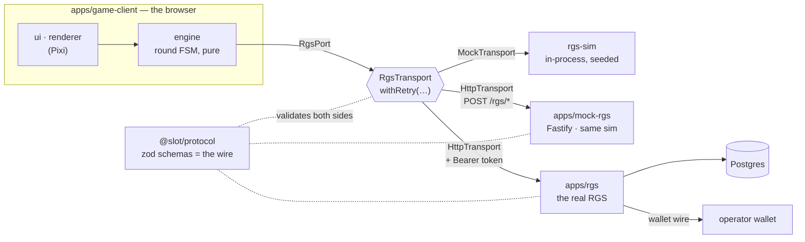
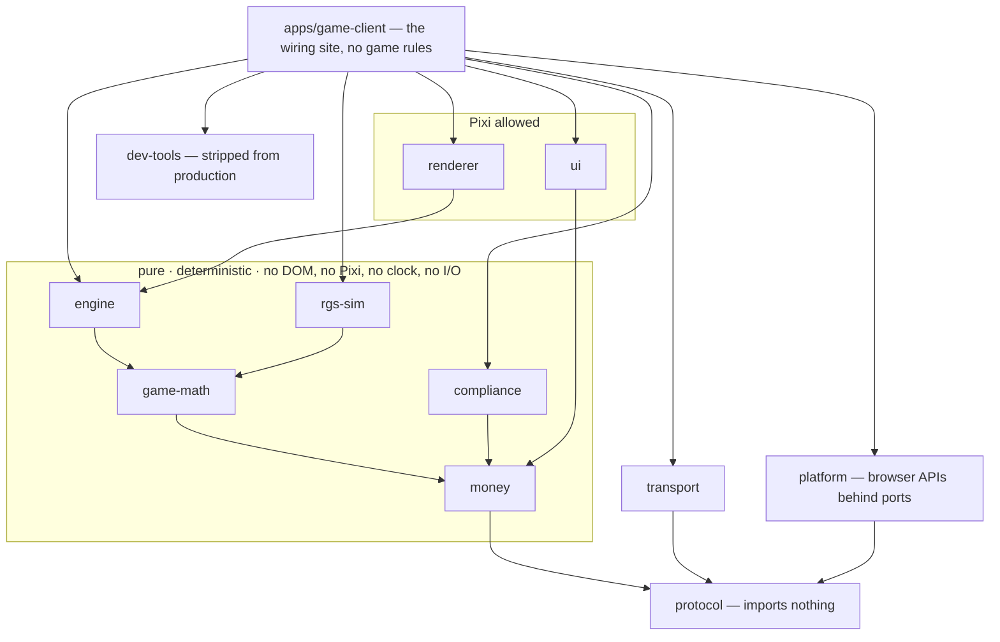
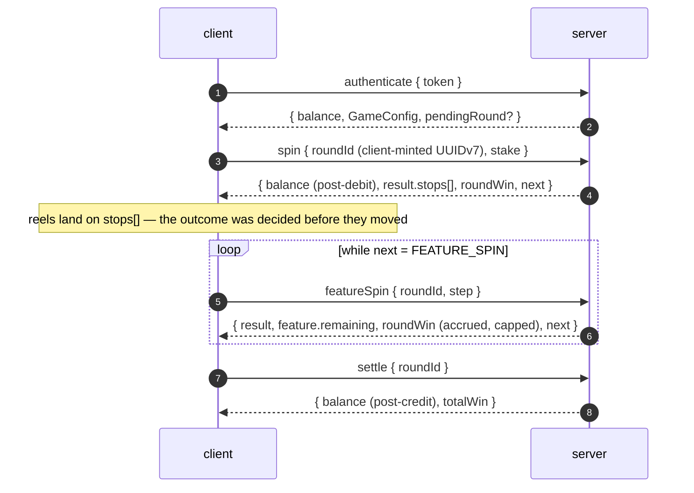
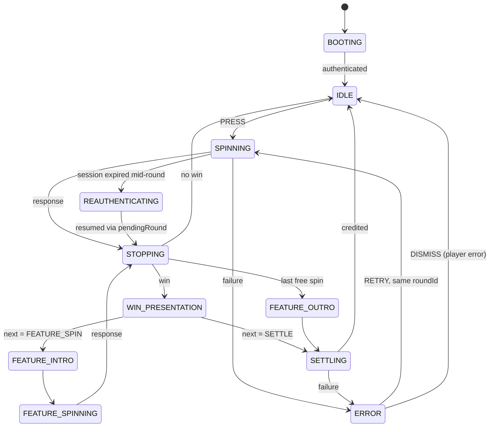

<div align="center">

# Aurora Reels

**A server-authoritative slot game client — PixiJS + TypeScript — with the simulator, the contract
and a real Node.js RGS it plays against.**

[](https://github.com/KuliyevMerdan/slots/actions/workflows/ci.yml)


<!-- The big-win GIF lands here. Record it from the live page: DEV → FORCE OUTCOME → MAX_WIN,
     capture the reels landing and the MEGA WIN count-up. -->

### [▶ Play the live demo](https://aurora-reels-demo.onrender.com/)

**18+ · Demo · Play money only — no real money, no payments, no crypto.**

</div>

> **[aurora-reels-demo.onrender.com](https://aurora-reels-demo.onrender.com/)** — press **DEV**
> in the corner, force a **MAX_WIN**, and watch the client *present* an outcome it had no part in deciding. The demo runs
> on a free tier that sleeps when idle: the first visit after a quiet spell takes about a minute
> to wake it.
>
> Or run the same image locally:
>
> ```bash
> docker build -f apps/mock-rgs/Dockerfile -t slot-demo . && docker run --rm -p 8787:8787 slot-demo
> ```

---

## Contents

- [The thesis](#the-thesis)
- [Two minutes with the demo](#two-minutes-with-the-demo)
- [The game](#the-game)
- [Architecture](#architecture)
- [How a round works](#how-a-round-works)
- [When things go wrong](#when-things-go-wrong)
- [The client: engine, reels, feel](#the-client-engine-reels-feel)
- [The server: from simulator to a real RGS](#the-server-from-simulator-to-a-real-rgs)
- [Measured, not promised](#measured-not-promised)
- [Tested rather than claimed](#tested-rather-than-claimed)
- [Running it](#running-it)
- [The monorepo](#the-monorepo)
- [Documentation map](#documentation-map)
- [Licensing](#licensing)

---

## The thesis

**The client never decides outcomes. It presents an outcome the server already committed to.**

Every spin is answered with `stops[]` — the authoritative reel positions — plus the balance after
the operation. The client lands the reels on those stops, lights the paylines the server named, and
shows the balance the server sent. It never adds, subtracts or pays anything.

It does ship the paytable, because highlighting a payline and sequencing a win animation need one.
It never uses it to *decide*: in dev builds it re-evaluates the server's grid and screams into
telemetry if the win set disagrees. **Presentation logic, not authority.**

|                        | The server                          | The client                                  |
| ---------------------- | ----------------------------------- | ------------------------------------------- |
| Reel outcome           | draws `stops[]` from a seeded PRNG  | lands the reels exactly on them             |
| Wins                   | evaluates and pays                  | highlights, and re-checks in dev builds     |
| Balance                | debits, credits, reports            | displays the number it was sent — only that |
| Free-spin arithmetic   | awards, retriggers, folds totals    | announces what arrived                      |
| Max-win cap            | applied as the round accrues        | counts up to the capped `roundWin`          |
| Round identity         | replays a duplicate `roundId`       | mints the `roundId`, reuses it on retry     |

The whole project exists to make that split real at every layer — and then to prove it with tests
rather than assert it in prose.

---

## Two minutes with the demo

1. **Spin.** The reels land where the server said; the balance is the server's post-debit number.
2. **Press DEV → FORCE OUTCOME → MAX_WIN.** The next spin is a forced outcome, found *on the
   real strips* by the server. Watch the tiered banner and the count-up — skip it with any press, and it lands on
   exactly the same final number.
3. **Force FREE_SPINS_TRIGGER, then reload mid-feature.** The page comes back *in the feature*, on
   the free spin it left, and the round is credited exactly once. There is no recovery endpoint:
   `authenticate` returned the open round.
4. **DEV → FAULTS → drop rate 0.5 → APPLY.** Half the responses now vanish after the server
   executed them. The client times out, retries with the **same `roundId`**, and the server replays
   its stored answer — no second debit. That is the scenario the whole idempotency design exists for.
5. **DEV → EXPIRE SESSION, mid-round.** The next call is refused; the client renews through the
   lobby and resumes the round, with no error screen.
6. **`?lang=ru`** switches the language; **Tab** reaches a real button for every control; the
   drawer holds your round history and the limits you set yourself.

Every visitor gets their own simulator, so none of this touches anyone else playing at the same
time.

---

## The game

A 5×3 video slot with 20 fixed paylines, wilds, scatters and a retriggering free-spins feature.

| Feature          | Rule                                                                                      |
| ---------------- | ----------------------------------------------------------------------------------------- |
| Grid & lines     | 5 reels × 3 rows, 20 paylines, all played; the stake is split evenly across lines         |
| Symbols          | `WILD`, `SCAT`, three high symbols (`H1`–`H3`), four low symbols (`L1`–`L4`)              |
| Wilds            | substitute for any line symbol except the scatter; a line that *starts* with wilds pays the better of the two readings |
| Scatters         | pay anywhere on the total stake: 3 → 8×, 4 → 40×, 5 → 200×                                |
| Free spins       | 3 / 4 / 5 scatters award 10 / 15 / 20 free spins, retriggerable inside the feature        |
| Round            | one stake buys the base spin *and* every free spin it leads to — one debit, one credit    |
| Max win          | 5,000 × the stake played, applied as the round accrues                                    |
| Bet ladder       | 0.20 – 40.00 in eight steps (integer minor units on the wire)                             |
| Jurisdictions    | `DEFAULT`, and `UK`: 2.5 s minimum game cycle, no turbo, no autoplay, hourly reality check |

Strips, paylines and the paytable are **data** in `@slot/game-math`, versioned as `MATH_VERSION`
2.0.0. A client whose math version differs from the server's refuses to play — there is no safe
way to present an outcome you cannot reproduce.

---

## Architecture

### The seam everything hangs on



The client depends on `@slot/protocol` — zod schemas whose inferred types *are* the wire types —
and never on a server implementation. **Which server it plays against is one environment
variable** (`VITE_RGS_TRANSPORT=mock|http`, plus a base URL). The claim is enforced, not hoped: one
contract suite plays the whole protocol — lifecycle, idempotent replay, recovery, every error
class — against **all three targets** above.

### Layers, and the rules between them



- **Boundaries are enforced by `dependency-cruiser` in CI.** `engine` importing Pixi fails the
  build; `apps/rgs` importing the simulator it replaces fails the build. The rules are themselves
  tested by fixture files that must stay illegal — a rule nobody has watched fail is a rule you
  are trusting, not enforcing.
- **Purity is linted.** In the five pure packages `Math.random()`, `Date.now()` and `fetch` are
  lint errors, and `window` / `document` are type errors (no `DOM` lib). Clocks and entropy are
  injected, so a seed replays an identical session — which is what makes the soaks, the RTP report
  and the E2E suite trustworthy.
- **When a pure package needs something its boundary forbids, it takes the shape as an argument**
  — the engine takes an `RgsPort`, the simulator a storage port, the transport an in-process
  backend. No shortcut imports; the import *is* the architecture.

---

## How a round works



Four calls, and seven design points that carry the weight:

1. **`roundId` is minted by the client**, so a retry after a timeout is *provably the same round*.
   The server returns the stored answer for a duplicate key instead of spinning again; the same key
   with different parameters is `ROUND_CONFLICT`.
2. **`stops[]` is the outcome; `view` is derived.** Sending both lets the client assert consistency
   and makes strip-alignment bugs debuggable.
3. **`pendingRound` on `authenticate` is the entire recovery path.** Reload, reconnect, crash — the
   client authenticates and continues whatever round is open. There is no separate endpoint to
   keep in step.
4. **Money is integer minor units everywhere**, behind a branded `Minor` type, so `stake + 0.1` is
   a compile error rather than a rounding incident. Every operation is exact or it throws.
5. **The client never computes a balance.** Every response carries the authoritative balance
   after the operation it describes — which is why `settle` is an explicit call.
6. **One round is one stake, one debit and one credit.** Free spins are *steps* inside it, keyed
   `(roundId, step)`, so a disconnect on spin 7 of 10 resumes at spin 7.
7. **The ceiling is a multiple of the stake, applied as the round accrues.** Every response
   carries `roundWin` — already capped — so the count-up ends on the number the balance receives.

The full wire contract, every shape and every rejected alternative, is
[docs/protocol.md](docs/protocol.md); the lifecycle with all its failure paths is
[docs/round-lifecycle.md](docs/round-lifecycle.md).

---

## When things go wrong

Every error code belongs to exactly one of three classes, and the client branches on the class —
never on a message string. The class is derived from the code, so a server that mislabels an error
cannot talk the client into retrying a spin the player cannot afford.

| Class         | Codes                                                                                   | What the client does |
| ------------- | --------------------------------------------------------------------------------------- | -------------------- |
| `RECOVERABLE` | `TIMEOUT` · `UPSTREAM_UNAVAILABLE` · `WALLET_UNAVAILABLE` · `RATE_LIMITED`                | Backoff and retry **with the same `roundId`**; the server's `retryAfterMs` wins over the client's guess |
| `PLAYER`      | `INSUFFICIENT_FUNDS` · `STAKE_NOT_ALLOWED` · `SESSION_EXPIRED` · `LIMIT_REACHED`          | A modal, back to idle, no retry — except `SESSION_EXPIRED` under an open round, which renews and resumes transparently |
| `FATAL`       | `SCHEMA_MISMATCH` · `UNKNOWN_ROUND` · `ROUND_CONFLICT` · `ILLEGAL_TRANSITION` · `MATH_VERSION_MISMATCH` · … | Freeze the reels, error screen, offer a reload |

And the failures that matter most, played out:

| What happens                                         | Why nothing is lost |
| ---------------------------------------------------- | ------------------- |
| The request never reaches the server                 | Nothing happened; the retry is the first attempt |
| The server executes the spin and the response is lost | The retry carries the same `roundId`; the server replays the stored answer — one debit |
| The tab is closed mid-feature                        | `authenticate` returns `pendingRound`; the reels land on the decided outcome and play on |
| The session expires mid-round                        | The client renews through the lobby, re-authenticates, and resumes from `pendingRound` |
| The wallet debits, then the server dies before the round opens | The stranded round is reported on `authenticate` and resumed by the client's ordinary retry |
| The wallet confirms a debit whose round then fails to open | The debit is rolled back; the same-`roundId` retry converges to exactly one standing debit |

---

## The client: engine, reels, feel

### The engine — a pure state machine



Any call phase can fail the same way; the diagram shows two. A `FATAL` error leaves the machine in
`ERROR` for good — the reels freeze, and only a reload leaves it.

`@slot/engine` has zero Pixi, zero DOM, zero network, and runs entirely under Vitest. It is one
pure function — `(state, input) → (state, events, effects)` — and a thin driver that performs the
effects. Every phase is its own type in an exhaustive union, so nothing can read a result that
does not exist yet.

There is **one player input — `PRESS` — and what it means depends on the phase**. An input a phase
cannot service is rejected, never queued, which kills the most common slot bug of all: the second
spin that starts while the first is still paying out.

| Press during                    | Effect                                                          |
| ------------------------------- | --------------------------------------------------------------- |
| `SPINNING` / `FEATURE_SPINNING` | **Slam stop** — the reels land sooner, on the same stops        |
| `WIN_PRESENTATION`              | **Skip** — arrives at *exactly* the state completing would have |
| `FEATURE_INTRO` / `FEATURE_OUTRO` | **Skip** — straight to the next free spin, or to the settle    |

A reload is the same machine entered halfway: `authenticate`'s `pendingRound` drops it into the
phase that continues the round.

### The reels — feel as tested code

The spin curve is a pure function `(motion, dt) → motion` with no Pixi in sight, so the things that
must be true underneath the animation are unit tests: every stop is landed **exactly**, at three
frame rates; a slam lands sooner on the same stop; the stages run in order.

1. **Anticipation dip** — a brief backwards hold before launch
2. **Acceleration** — ease-in to blur velocity
3. **Constant velocity** — motion-blurred symbols; where a reel waits its turn
4. **Deceleration** — ease-out onto a landing computed once, absolutely
5. **Overshoot + settle** — a third of a symbol past, and back onto the integer

Reel stops are staggered 140 ms apart, and **scatter anticipation** holds the later reels while the
landed ones could still trigger the feature. Wins play as a **timeline** — count-up, tiered banner
(NICE 5× · BIG 15× · MEGA 50× the stake), then each line in turn — and `complete()` runs every
remaining step to its end, which is why a skip and a full play produce identical final screens.

**Turbo** shortens the curve without changing its shape; **`prefers-reduced-motion`** removes the
stages entirely — no dip, no overshoot, no stagger — and still lands on the server's exact stop.

### Around the reels

- **Player protection** — pacing, a time-only reality check (with EXIT as well as CONTINUE),
  autoplay with stop conditions, and self-set session time and loss limits that stop play when
  breached. Jurisdiction rules arrive **on the wire**, and each side enforces what it can observe.
- **Accessibility** — a real DOM button for every control, focus-trapped dialogs, a polite live
  region announcing *state* (not events), WCAG AA contrast held by a test.
- **Languages** — English and Russian, with every character of both catalogues checked against the
  shipped Inter font at every weight. Money is formatted by `Intl`, never by the catalogue.
- **Audio** — seven cues synthesized at boot from oscillator math; muted when the tab is hidden,
  unlocked on the first gesture.
- **Round history** — the server's own record of settled rounds, in a drawer, in every build.
- **Dev tools** — force an outcome, inject faults, switch jurisdiction (in-process), expire the
  session, inspect both machines, export an event log correlated by `roundId`. All of it is compile-stripped from
  production, and `verify:strip` fails the build if any of it reaches `dist/`.

---

## The server: from simulator to a real RGS

Three servers speak the same contract, each for a reason:

| Server           | What it is for |
| ---------------- | -------------- |
| `@slot/rgs-sim`  | The **reference semantics**: a pure, seeded simulator — handlers are `(state, request) → (state, response)`. It runs in the browser for the dev loop, over HTTP for the network path, and underneath the RTP report. Named forced outcomes and seeded fault injection make every scenario producible on demand. |
| `apps/mock-rgs`  | The simulator over a real socket, in about two hundred lines of Fastify. It proves the client behaves identically in-process and over HTTP — and it is the hosted demo: it serves the client from its own origin (no CORS) and gives **every visitor their own simulator**. |
| `apps/rgs`       | **The real RGS**, laid out the way production ones are. It passes the same contract suite. |

`apps/rgs`, piece by piece:

- **Rounds & idempotency on Postgres** — committed migrations, compare-and-swap transitions, an
  insert-only idempotency table; an in-memory twin held to the same contract suite.
- **A wallet over the wire** — an operator wallet API with per-attempt deadlines and bounded
  retries that are safe because every mutation is idempotent on its reference. A debit whose round
  fails to open is rolled back, so a wallet failure mid-round leaves no orphaned debit — as a test.
- **A double-entry ledger** — append-only (a Postgres trigger enforces it), one entry pair per
  confirmed movement, and a reconciliation job that finds what balance checks cannot see.
- **Provable fairness** — a SHA-256 commitment published before the bet, the seed bound at open,
  revealed when the round closes. The player's whole verification ships in `@slot/game-math` and
  needs nothing from the server it checks ([docs/fairness.md](docs/fairness.md)).
- **Real sessions** — bearer tokens minted from a CSPRNG through a key-guarded operator surface,
  server-side pacing, and per-token and per-IP rate limits.
- **Observable** — one structured log line per call, OpenTelemetry spans and Prometheus metrics,
  all joined on `roundId`; the money-side failures that must never be silent raise an alert metric
  at the failure site.
- **Deployable** — a production boot contract that refuses every dev placeholder, one image, a
  health-gated `docker-compose`, a race suite and a backup-restore drill running in CI
  ([docs/deploy.md](docs/deploy.md)).

---

## Measured, not promised

### The math

`pnpm math-sim` plays complete rounds through **the same outcome engine both servers use** — one
implementation is the only reason the published figure means anything. Over **20,000,000 rounds**:

| Measure                  | Result      | Design    |
| ------------------------ | ----------- | --------- |
| **RTP**                  | **96.107%** | 96 ± 0.5% |
| — base game              | 87.131%     |           |
| — feature                | 8.976%      |           |
| Hit frequency            | 43.45%      | 25–45%    |
| Volatility (σ per round) | 3.05        | medium    |
| Spins per feature        | 110         | 80–250    |
| Longest feature seen     | 70 spins    | ≤ 120     |
| Max win seen             | 304× stake  |           |

A round is the unit — the feature's return belongs to the stake that paid for it. The CLI exits
non-zero when the game leaves its band, so the report is also a regression test; a 250k-round run
gates every push.

### Performance

`pnpm perf` drives the **production bundle** in headless Chrome at a **4× CPU throttle** through
the DOM control layer — no dev hooks; the bundle measured is the bundle that ships:

| Measure    | Result                                        |
| ---------- | --------------------------------------------- |
| Frame rate | ~120 fps average, p95 9.2 ms, 1 drop in 3,888 |
| Draw calls | 7 per frame (max 8) — one atlas, one batch    |
| Heap       | 9.8 → 14.1 → 9.4 MB sawtooth over 30 rounds   |

One generated texture atlas, a sprite pool allocated at boot, motion blur as a pre-rendered
texture swap rather than a filter, rectangle masks, and zero allocation in the ticker.

---

## Tested rather than claimed

**1,074 tests locally, ~1,104 in CI** (the Postgres twins join there), plus a Playwright job.

| Layer | What it proves |
| ----- | -------------- |
| **Contract** | The whole protocol against every server — the gate that makes "swap the URL" a claim, not a hope |
| **Mash** | 120 rounds pressed at random through engine + transport + simulator + renderer; the client's balance equals the server's after every one |
| **Resume** | The client destroyed and rebuilt at five points mid-feature; the round finishes and is credited exactly once |
| **Soak** | 1,000 seeded rounds with retries and disconnects; 5,000 over a real socket nightly, heap trend asserted |
| **Races & restore** | Identical, conflicting and duplicate calls fired *simultaneously* against real row locks; a mid-session dump → truncate → restore that finishes the interrupted feature |
| **Ledger** | A scripted session's journal sums to zero and reproduces every balance the wire reported |
| **Fairness** | A "player" recomputes every step's `stops[]` from the reveal, with the shipped math alone |
| **E2E** | The deployed composition in a real browser: a spin, a feature, a reload mid-feature, two visitors at once — money asserted against engine and server |
| **Feel & access** | The spin curve's exact landings, WCAG AA contrast, glyph coverage for both languages |
| **Boundaries** | Illegal imports that must stay illegal, and lint rules that must keep firing |

---

## Running it

Node ≥ 20.19 and pnpm 10.

```bash
pnpm install
pnpm dev:client        # the game with the simulator in the tab — zero latency, zero setup
pnpm dev               # the game over HTTP against apps/mock-rgs, through Vite's proxy
pnpm check             # lint → build → typecheck → test → contract → format — what CI runs
```

| Command            | What it does |
| ------------------ | ------------ |
| `pnpm test:contract` | The contract suite against every server |
| `pnpm e2e`         | Playwright against the deployed composition |
| `pnpm math-sim`    | The RTP report — `pnpm math-sim --spins 20000000` |
| `pnpm perf`        | fps, draw calls and heap for a scripted session |
| `pnpm load`        | Multi-client load on a running RGS; drift in the closing balance fails it |

The client plays the real RGS the same way it plays the simulator — configuration, not code:
`docker compose up` brings up the RGS, Postgres and a wallet, and the client points at it with
`VITE_RGS_TRANSPORT=http` and a token ([docs/deploy.md](docs/deploy.md)).

---

## The monorepo

pnpm workspaces + Turborepo, TypeScript strict with `noUncheckedIndexedAccess` everywhere.

| Package             | What it is                                                              |
| ------------------- | ----------------------------------------------------------------------- |
| `@slot/protocol`    | The wire contract: zod schemas, inferred types, error taxonomy — imports nothing |
| `@slot/money`       | Branded integer minor units; exact arithmetic or a throw                 |
| `@slot/game-math`   | Strips, paytable, evaluator — and the outcome engine both servers share  |
| `@slot/engine`      | Headless round FSM — no Pixi, no DOM, no network; runs under Vitest      |
| `@slot/transport`   | `RgsTransport` + Mock/Http implementations + the retry policy            |
| `@slot/rgs-sim`     | The pure simulator core — dev loop, HTTP path and RTP report share it    |
| `@slot/renderer`    | Pixi reels: spin curve, generated atlas, sprite pool, win timelines      |
| `@slot/ui`          | Pixi control panel — takes a view model, never the engine                |
| `@slot/platform`    | Audio synthesis, storage, visibility, safe areas — browser APIs as ports |
| `@slot/compliance`  | Jurisdiction rules, reality check, autoplay stops, session limits — pure |
| `@slot/dev-tools`   | Debug panel over existing seams; `verify:strip` proves it out of prod    |
| `apps/game-client`  | The deliverable — the wiring site with no game rules in it               |
| `apps/mock-rgs`     | A sim per visitor over Fastify, serving the client too (ADR-0010, 0011)  |
| `apps/rgs`          | The real RGS: Postgres, wallet wire, ledger, fairness, sessions, observability |
| `tools/*`           | `math-sim` (RTP), `perf-harness` (fps/heap), `load-test` (latency + drift) |

---

## Documentation map

| Read                                                   | For |
| ------------------------------------------------------ | --- |
| [docs/architecture.md](docs/architecture.md)           | The guided tour — start here after this page |
| [docs/protocol.md](docs/protocol.md)                   | The wire contract: every call, shape, rule and rejected alternative |
| [docs/round-lifecycle.md](docs/round-lifecycle.md)     | A round's life and every failure path, diagrammed |
| [docs/fairness.md](docs/fairness.md)                   | How a player verifies a round |
| [docs/wallet-api.md](docs/wallet-api.md)               | The operator wallet contract |
| [docs/deploy.md](docs/deploy.md)                       | Running the RGS and hosting the demo |
| [docs/adr/](docs/adr/)                                 | Eleven decisions that would surprise a reviewer, argued |
| [CLAUDE.md](CLAUDE.md) · [ROADMAP.md](ROADMAP.md)      | The maintainer's canon and the task map |

---

## Licensing

All art and audio are **generated at boot from code** — the symbol atlas is drawn into one
texture, the sounds are synthesized — so there are no binary assets and nothing to license or
attribute. Inter (OFL) is the one typeface, subsetted for Latin and Cyrillic. TypeScript, PixiJS
v8, Fastify v5, zod v4.

**Play money only.** The 18+/demo notice is rendered under the canvas on every screen, in both
languages.
