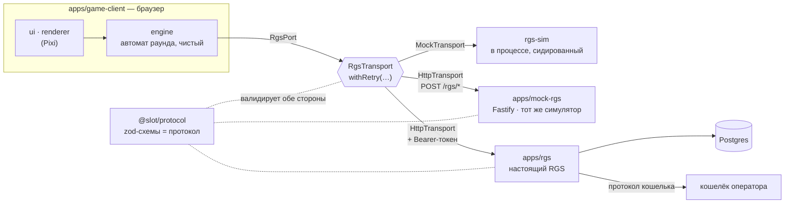
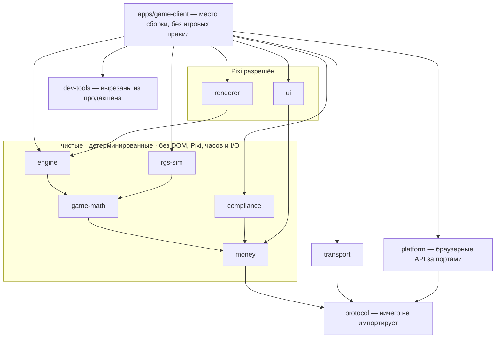
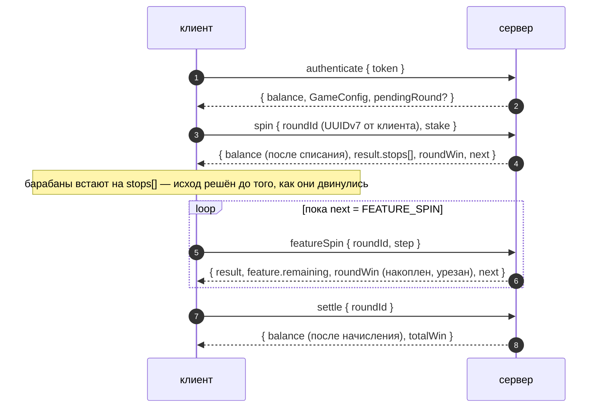
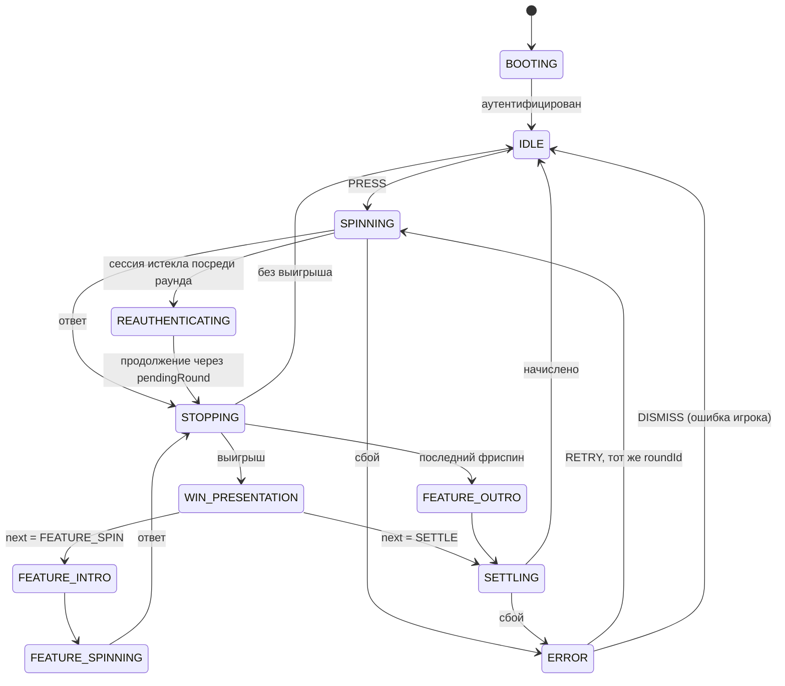

<div align="center">

# Aurora Reels

[English](README.md) · **Русский**

**Клиент слот-игры, где все решения принимает сервер, — PixiJS + TypeScript — вместе с
симулятором, контрактом и настоящим RGS на Node.js, против которого он играет.**

[](https://github.com/KuliyevMerdan/slots/actions/workflows/ci.yml)


<!-- Сюда встанет GIF крупного выигрыша. Записать с живой страницы: DEV → FORCE OUTCOME → MAX_WIN,
     снять остановку барабанов и счётчик MEGA WIN. -->

### [▶ Играть в живое демо](https://aurora-reels-demo.onrender.com/)

**18+ · Демо · Только игровые деньги — никаких реальных денег, платежей и криптовалюты.**

</div>

> **[aurora-reels-demo.onrender.com](https://aurora-reels-demo.onrender.com/)** — нажми **DEV** в
> углу, форсируй **MAX_WIN** и посмотри, как клиент *показывает* исход, в выборе которого он не
> участвовал. Демо работает на бесплатном тарифе, который засыпает без трафика: первый заход после
> простоя будит его примерно минуту.
>
> Или запусти тот же образ локально:
>
> ```bash
> docker build -f apps/mock-rgs/Dockerfile -t slot-demo . && docker run --rm -p 8787:8787 slot-demo
> ```

---

## Содержание

- [Главная идея](#главная-идея)
- [Две минуты с демо](#две-минуты-с-демо)
- [Игра](#игра)
- [Архитектура](#архитектура)
- [Как устроен раунд](#как-устроен-раунд)
- [Когда что-то ломается](#когда-что-то-ломается)
- [Клиент: движок, барабаны, ощущение](#клиент-движок-барабаны-ощущение)
- [Сервер: от симулятора к настоящему RGS](#сервер-от-симулятора-к-настоящему-rgs)
- [Измерено, а не обещано](#измерено-а-не-обещано)
- [Проверено тестами, а не словами](#проверено-тестами-а-не-словами)
- [Запуск](#запуск)
- [Монорепозиторий](#монорепозиторий)
- [Карта документации](#карта-документации)
- [Лицензии](#лицензии)

---

## Главная идея

**Клиент никогда не решает исход. Он показывает исход, который сервер уже зафиксировал.**

На каждый спин сервер отвечает массивом `stops[]` — авторитетными позициями барабанов — и балансом
после операции. Клиент останавливает барабаны ровно на этих позициях, подсвечивает линии, которые
назвал сервер, и показывает баланс, который прислал сервер. Сам он ничего не прибавляет, не вычитает
и не выплачивает.

Таблица выплат в клиенте есть: без неё не подсветить линию и не выстроить анимацию выигрыша. Но
*решать* что-либо по ней клиент не может: в dev-сборках он пересчитывает сетку сервера и громко
сообщает в телеметрию, если набор выигрышей не совпал. **Логика показа, а не власть.**

|                        | Сервер                                    | Клиент                                       |
| ---------------------- | ----------------------------------------- | -------------------------------------------- |
| Исход барабанов        | вытягивает `stops[]` из сидированного ГПСЧ | останавливает барабаны ровно на них          |
| Выигрыши               | считает и выплачивает                     | подсвечивает, в dev-сборках перепроверяет    |
| Баланс                 | списывает, начисляет, сообщает            | показывает присланное число — и только его   |
| Арифметика фриспинов   | начисляет, ретриггерит, сводит итоги      | объявляет то, что пришло                     |
| Лимит выигрыша         | применяется по мере накопления раунда     | досчитывает до уже урезанного `roundWin`     |
| Идентичность раунда    | повторяет ответ на дубликат `roundId`     | создаёт `roundId`, повторно использует при ретрае |

Весь проект существует, чтобы сделать это разделение реальным на каждом слое — и доказать его
тестами, а не утверждать в тексте.

---

## Две минуты с демо

1. **Сделай спин.** Барабаны остановятся там, где сказал сервер; баланс — это число сервера после
   списания.
2. **Нажми DEV → FORCE OUTCOME → MAX_WIN.** Следующий спин будет форсированным исходом, который
   сервер находит *на настоящих лентах барабанов*. Смотри на баннер и счётчик выигрыша — пропусти
   его любым нажатием, и он остановится на том же самом итоговом числе.
3. **Форсируй FREE_SPINS_TRIGGER и перезагрузи страницу посреди фичи.** Страница вернётся *в
   фичу*, на тот фриспин, где ты остановился, и раунд будет начислен ровно один раз. Отдельного
   эндпоинта восстановления нет: открытый раунд вернул `authenticate`.
4. **DEV → FAULTS → drop rate 0.5 → APPLY.** Теперь половина ответов пропадает уже после того,
   как сервер выполнил запрос. Клиент ждёт таймаут, повторяет запрос с **тем же `roundId`**, и
   сервер отдаёт сохранённый ответ — без второго списания. Именно ради этого сценария построена
   вся идемпотентность.
5. **DEV → EXPIRE SESSION посреди раунда.** Следующий вызов получает отказ; клиент продлевает
   сессию через лобби и продолжает раунд без экрана ошибки.
6. **`?lang=ru`** переключает язык; **Tab** доходит до настоящей кнопки для каждого элемента
   управления; в выдвижной панели — история раундов и лимиты, которые ты задал себе сам.

У каждого посетителя свой симулятор, поэтому всё это никак не затрагивает тех, кто играет
одновременно с тобой.

---

## Игра

Видеослот 5×3 с 20 фиксированными линиями, wild, scatter и бонусными фриспинами с ретриггером.

| Что                 | Правило                                                                                 |
| ------------------- | --------------------------------------------------------------------------------------- |
| Сетка и линии       | 5 барабанов × 3 ряда, 20 линий, играют все; ставка делится поровну между линиями        |
| Символы             | `WILD`, `SCAT`, три старших (`H1`–`H3`), четыре младших (`L1`–`L4`)                     |
| Wild                | заменяет любой линейный символ, кроме scatter; линия, которая *начинается* с wild, платит лучшее из двух прочтений |
| Scatter             | платит в любом месте от общей ставки: 3 → 8×, 4 → 40×, 5 → 200×                         |
| Фриспины            | 3 / 4 / 5 scatter дают 10 / 15 / 20 фриспинов, внутри фичи возможен ретриггер           |
| Раунд               | одна ставка покупает базовый спин *и* все фриспины, к которым он привёл — одно списание, одно начисление |
| Максимальный выигрыш | 5 000 × сыгранной ставки, применяется по мере накопления раунда                        |
| Ставки              | от 0.20 до 40.00, восемь шагов (на проводе — целые минорные единицы)                    |
| Юрисдикции          | `DEFAULT` и `UK`: минимальный игровой цикл 2.5 с, без турбо, без автоигры, reality check раз в час |

Ленты барабанов, линии и таблица выплат — это **данные** в `@slot/game-math` с версией
`MATH_VERSION` 2.0.0. Клиент, у которого версия математики отличается от серверной, отказывается
играть: нельзя безопасно показать исход, который ты не можешь воспроизвести.

---

## Архитектура

### Шов, на котором держится всё



Клиент зависит от `@slot/protocol` — zod-схем, выведенные типы которых *и есть* типы протокола, — и
никогда не зависит от реализации сервера. **С каким сервером он играет, решает одна переменная
окружения** (`VITE_RGS_TRANSPORT=mock|http` плюс базовый URL). Это не надежда, а проверяемое
утверждение: один контрактный набор тестов прогоняет весь протокол — жизненный цикл,
идемпотентный повтор, восстановление, каждый класс ошибок — против **всех трёх серверов** на схеме.

### Слои и правила между ними



- **Границы проверяет `dependency-cruiser` в CI.** Если `engine` импортирует Pixi, сборка падает;
  если `apps/rgs` импортирует симулятор, который он заменяет, сборка падает. Сами правила тоже
  протестированы — файлами-фикстурами, которые обязаны оставаться нелегальными. Правило, которое
  никто не видел срабатывающим, — это правило, которому доверяют, а не которое соблюдают.
- **Чистота проверяется линтером.** В пяти чистых пакетах `Math.random()`, `Date.now()` и `fetch`
  — ошибки линтера, а `window` / `document` — ошибки типов (нет библиотеки `DOM`). Часы и
  энтропия передаются снаружи, поэтому сид воспроизводит сессию байт в байт — на этом держится
  доверие к soak-тестам, отчёту RTP и E2E.
- **Когда чистому пакету нужно то, что запрещено его границей, он принимает это как аргумент** —
  движок получает `RgsPort`, симулятор — порт хранилища, транспорт — бэкенд в процессе. Никаких
  импортов-обходов: импорт *и есть* архитектура.

---

## Как устроен раунд



Четыре вызова и семь принципов, на которых всё держится:

1. **`roundId` создаёт клиент**, поэтому повтор после таймаута — *доказуемо тот же раунд*. На
   дубликат ключа сервер отдаёт сохранённый ответ, а не крутит заново; тот же ключ с другими
   параметрами — это `ROUND_CONFLICT`.
2. **Исход — это `stops[]`, а `view` из него выводится.** Сервер присылает оба, поэтому клиент
   может проверить их согласованность, а ошибки выравнивания лент легко отлаживать.
3. **`pendingRound` в ответе `authenticate` — это весь путь восстановления.** Перезагрузка,
   переподключение, падение — клиент аутентифицируется и продолжает открытый раунд. Отдельного
   эндпоинта, который надо поддерживать в согласии, нет.
4. **Деньги везде — целые минорные единицы** за брендированным типом `Minor`, поэтому
   `stake + 0.1` — ошибка компиляции, а не инцидент с округлением. Каждая операция либо точна,
   либо бросает исключение.
5. **Клиент никогда не вычисляет баланс.** Каждый ответ несёт авторитетный баланс после описанной
   операции — поэтому `settle` и сделан отдельным вызовом.
6. **Один раунд — одна ставка, одно списание, одно начисление.** Фриспины — это *шаги* внутри
   раунда с ключом `(roundId, step)`, поэтому обрыв на 7-м фриспине из 10 продолжится с 7-го.
7. **Потолок выигрыша — кратное ставки, и он применяется по мере накопления раунда.** Каждый ответ
   несёт `roundWin`, уже урезанный, поэтому счётчик останавливается ровно на сумме, которую получит
   баланс.

Полный контракт протокола, все структуры и все отвергнутые альтернативы — в
[docs/protocol.md](docs/protocol.md); жизненный цикл со всеми путями сбоев — в
[docs/round-lifecycle.md](docs/round-lifecycle.md) (документация на английском).

---

## Когда что-то ломается

Каждый код ошибки принадлежит ровно одному из трёх классов, и клиент ветвится по классу — никогда
по тексту сообщения. Класс выводится из кода, поэтому сервер, неверно пометивший ошибку, не сможет
уговорить клиента повторить спин, на который у игрока нет денег.

| Класс         | Коды                                                                                    | Что делает клиент |
| ------------- | --------------------------------------------------------------------------------------- | ----------------- |
| `RECOVERABLE` | `TIMEOUT` · `UPSTREAM_UNAVAILABLE` · `WALLET_UNAVAILABLE` · `RATE_LIMITED`                | Повтор с нарастающей паузой **с тем же `roundId`**; `retryAfterMs` от сервера важнее догадки клиента |
| `PLAYER`      | `INSUFFICIENT_FUNDS` · `STAKE_NOT_ALLOWED` · `SESSION_EXPIRED` · `LIMIT_REACHED`          | Модальное окно, возврат в ожидание, без повтора — кроме `SESSION_EXPIRED` при открытом раунде: тогда сессия незаметно продлевается и раунд продолжается |
| `FATAL`       | `SCHEMA_MISMATCH` · `UNKNOWN_ROUND` · `ROUND_CONFLICT` · `ILLEGAL_TRANSITION` · `MATH_VERSION_MISMATCH` · … | Барабаны замирают, экран ошибки, предложение перезагрузиться |

И самые важные сбои — по шагам:

| Что происходит                                          | Почему ничего не теряется |
| ------------------------------------------------------- | ------------------------- |
| Запрос не дошёл до сервера                              | Ничего не произошло; повтор — это первая попытка |
| Сервер выполнил спин, а ответ потерялся                 | Повтор несёт тот же `roundId`; сервер отдаёт сохранённый ответ — одно списание |
| Вкладку закрыли посреди фичи                            | `authenticate` возвращает `pendingRound`; барабаны встают на решённый исход, игра продолжается |
| Сессия истекла посреди раунда                           | Клиент продлевает её через лобби, аутентифицируется заново и продолжает с `pendingRound` |
| Кошелёк списал, а сервер умер до открытия раунда        | Застрявший раунд возвращается в `authenticate`, и обычный повтор клиента его продолжает |
| Кошелёк подтвердил списание, а раунд не открылся        | Списание откатывается; повтор с тем же `roundId` сходится ровно к одному списанию |

---

## Клиент: движок, барабаны, ощущение

### Движок — чистый конечный автомат



Любая фаза с вызовом может упасть так же; на схеме показаны две. Ошибка класса `FATAL` оставляет
автомат в `ERROR` навсегда — барабаны замирают, выйти можно только перезагрузкой.

В `@slot/engine` нет ни Pixi, ни DOM, ни сети, и он целиком работает под Vitest. Это одна чистая
функция — `(state, input) → (state, events, effects)` — и тонкий драйвер, который выполняет
эффекты. Каждая фаза — свой тип в исчерпывающем объединении, поэтому никто не может прочитать
результат, которого ещё нет.

Ввод от игрока **один — `PRESS`, и его смысл зависит от фазы**. Ввод, который фаза не может
обработать, отклоняется, а не ставится в очередь. Это убивает самый частый баг слотов: второй
спин, стартующий, пока первый ещё выплачивается.

| Нажатие во время                  | Эффект                                                              |
| --------------------------------- | ------------------------------------------------------------------- |
| `SPINNING` / `FEATURE_SPINNING`   | **Slam stop** — барабаны встают раньше, на те же позиции            |
| `WIN_PRESENTATION`                | **Пропуск** — приводит *ровно* в то состояние, что и полный показ   |
| `FEATURE_INTRO` / `FEATURE_OUTRO` | **Пропуск** — сразу к следующему фриспину или к начислению          |

Перезагрузка — это тот же автомат, в который вошли на середине: `pendingRound` из `authenticate`
ставит его в фазу, продолжающую раунд.

### Барабаны — ощущение как протестированный код

Кривая вращения — чистая функция `(motion, dt) → motion` без всякого Pixi, поэтому то, что обязано
быть верным под анимацией, проверяют юнит-тесты: каждая позиция достигается **точно** при трёх
разных частотах кадров; slam останавливает раньше на той же позиции; стадии идут по порядку.

1. **Замах** — короткий откат назад перед стартом
2. **Разгон** — плавный набор скорости до размытия
3. **Постоянная скорость** — размытые символы; здесь барабан ждёт своей очереди
4. **Торможение** — плавный подход к точке остановки, вычисленной один раз и абсолютно
5. **Перелёт и возврат** — на треть символа дальше и обратно на целую позицию

Барабаны останавливаются с шагом 140 мс, а **ожидание scatter** придерживает последние барабаны,
пока уже вставшие ещё могут запустить фичу. Выигрыши проигрываются **таймлайном** — счётчик,
баннер по уровню (NICE 5× · BIG 15× · MEGA 50× ставки), затем каждая линия по очереди, — а
`complete()` доводит каждый оставшийся шаг до конца, поэтому пропуск и полный показ дают одинаковый
итоговый экран.

**Турбо** укорачивает кривую, не меняя её формы; **`prefers-reduced-motion`** убирает стадии
совсем — без замаха, перелёта и задержек — и всё равно останавливается ровно на позиции сервера.

### Вокруг барабанов

- **Защита игрока** — ограничение темпа, reality check только по времени (с кнопкой EXIT, а не
  только CONTINUE), автоигра с условиями остановки и самостоятельно заданные лимиты времени и
  проигрыша за сессию, которые останавливают игру при превышении. Правила юрисдикции приходят
  **по протоколу**, и каждая сторона применяет то, что может наблюдать.
- **Доступность** — настоящая DOM-кнопка для каждого элемента управления, диалоги с удержанием
  фокуса, вежливая live-область, объявляющая *состояние* (а не события), контраст WCAG AA,
  проверяемый тестом.
- **Языки** — английский и русский; каждый символ обоих каталогов проверен на наличие в
  поставляемом шрифте Inter во всех начертаниях. Деньги форматирует `Intl`, а не каталог строк.
- **Звук** — семь звуков, синтезированных при загрузке из математики осцилляторов; выключаются,
  когда вкладка скрыта, и разблокируются первым жестом.
- **История раундов** — собственная запись сервера о завершённых раундах, в выдвижной панели, в
  любой сборке.
- **Инструменты разработчика** — форсировать исход, внести сбои, переключить юрисдикцию (в
  процессе), истечь сессию, посмотреть оба автомата, выгрузить журнал событий, сгруппированный по
  `roundId`. Всё это вырезается из продакшена при компиляции, а `verify:strip` роняет сборку,
  если хоть что-то попало в `dist/`.

---

## Сервер: от симулятора к настоящему RGS

Три сервера говорят по одному контракту, и у каждого своя задача:

| Сервер           | Зачем он нужен |
| ---------------- | -------------- |
| `@slot/rgs-sim`  | **Эталонная семантика**: чистый сидированный симулятор — обработчики вида `(state, request) → (state, response)`. Он работает в браузере для цикла разработки, по HTTP для сетевого пути и в основе отчёта RTP. Именованные форсированные исходы и сидированная инъекция сбоев позволяют воспроизвести любой сценарий по требованию. |
| `apps/mock-rgs`  | Симулятор на настоящем сокете — около двухсот строк на Fastify. Доказывает, что клиент ведёт себя одинаково в процессе и по HTTP, — и это же хостинг демо: он отдаёт клиент со своего origin (без CORS) и даёт **каждому посетителю свой симулятор**. |
| `apps/rgs`       | **Настоящий RGS**, устроенный так, как устроены продакшен-серверы. Проходит тот же контрактный набор тестов. |

`apps/rgs` по частям:

- **Раунды и идемпотентность на Postgres** — закоммиченные миграции, переходы через
  compare-and-swap, таблица идемпотентности только на вставку; двойник в памяти проверяется тем же
  набором контрактных тестов.
- **Кошелёк по сети** — API кошелька оператора с дедлайном на каждую попытку и ограниченными
  повторами, безопасными потому, что каждая мутация идемпотентна по своей ссылке. Списание, чей
  раунд не открылся, откатывается, поэтому сбой кошелька посреди раунда не оставляет висящих
  списаний — и это тест.
- **Журнал с двойной записью** — только добавление (в Postgres это обеспечивает триггер), одна
  пара проводок на каждое подтверждённое движение, и задача сверки, которая находит то, чего не
  видят проверки баланса.
- **Доказуемая честность** — SHA-256-коммитмент публикуется до ставки, сид привязывается при
  открытии раунда и раскрывается при его закрытии. Вся проверка для игрока поставляется в
  `@slot/game-math` и не требует ничего от проверяемого сервера
  ([docs/fairness.md](docs/fairness.md)).
- **Настоящие сессии** — bearer-токены из криптостойкого генератора через защищённую ключом
  поверхность оператора, контроль темпа на сервере и лимиты запросов по токену и по IP.
- **Наблюдаемость** — одна структурированная строка лога на вызов, спаны OpenTelemetry и метрики
  Prometheus, всё связано по `roundId`; денежные сбои, которые никогда не должны быть тихими,
  поднимают метрику для алерта прямо в месте сбоя.
- **Готов к деплою** — продакшен-контракт загрузки, отвергающий любые dev-заглушки, один образ,
  `docker-compose` с проверками здоровья, а также тест гонок и учения по резервному копированию и
  восстановлению в CI ([docs/deploy.md](docs/deploy.md)).

---

## Измерено, а не обещано

### Математика

`pnpm math-sim` проигрывает полные раунды через **тот же движок исходов, что и оба сервера**:
только одна реализация делает опубликованную цифру осмысленной. На **20 000 000 раундов**:

| Показатель                 | Результат   | Цель      |
| -------------------------- | ----------- | --------- |
| **RTP**                    | **96.107%** | 96 ± 0.5% |
| — базовая игра             | 87.131%     |           |
| — фича                     | 8.976%      |           |
| Частота выигрышей          | 43.45%      | 25–45%    |
| Волатильность (σ на раунд) | 3.05        | средняя   |
| Спинов на одну фичу        | 110         | 80–250    |
| Самая длинная фича         | 70 спинов   | ≤ 120     |
| Максимальный выигрыш       | 304× ставки |           |

Единица измерения — раунд: возврат фичи принадлежит ставке, которая за неё заплатила. CLI
завершается с ненулевым кодом, если игра выходит из своего диапазона, поэтому отчёт — это ещё и
регрессионный тест; прогон на 250 тысяч раундов проверяет каждый пуш.

### Производительность

`pnpm perf` гоняет **продакшен-бандл** в headless Chrome с **замедлением CPU в 4 раза** через
DOM-слой управления — без dev-хуков; измеряется ровно тот бандл, что поставляется:

| Показатель   | Результат                                              |
| ------------ | ------------------------------------------------------ |
| Частота кадров | ~120 fps в среднем, p95 9.2 мс, 1 пропуск на 3 888 кадров |
| Draw calls   | 7 на кадр (максимум 8) — один атлас, один батч         |
| Память       | пила 9.8 → 14.1 → 9.4 МБ за 30 раундов                 |

Один сгенерированный атлас текстур, пул спрайтов, выделенный при загрузке, размытие движения как
подмена заранее отрисованной текстуры вместо фильтра, прямоугольные маски и ноль аллокаций в
тикере.

---

## Проверено тестами, а не словами

**1 074 теста локально, ~1 104 в CI** (там подключаются двойники на Postgres), плюс задача
Playwright.

| Слой | Что доказывает |
| ---- | -------------- |
| **Контракт** | Весь протокол против каждого сервера — проверка, благодаря которой «поменять URL» становится утверждением, а не надеждой |
| **Mash** | 120 раундов со случайными нажатиями через движок + транспорт + симулятор + рендерер; баланс клиента равен балансу сервера после каждого |
| **Возобновление** | Клиент уничтожается и собирается заново в пяти точках посреди фичи; раунд завершается и начисляется ровно один раз |
| **Soak** | 1 000 сидированных раундов с повторами и обрывами; 5 000 по настоящему сокету каждую ночь с проверкой тренда памяти |
| **Гонки и восстановление** | Одинаковые, конфликтующие и дублирующиеся вызовы, отправленные *одновременно* против настоящих блокировок строк; дамп → очистка → восстановление посреди сессии, после которого прерванная фича доигрывается |
| **Журнал** | Журнал сценарной сессии сходится в ноль и воспроизводит каждый баланс, который сообщил протокол |
| **Честность** | «Игрок» пересчитывает `stops[]` каждого шага из раскрытого сида, используя только поставляемую математику |
| **E2E** | Задеплоенная сборка в настоящем браузере: спин, фича, перезагрузка посреди фичи, два посетителя одновременно — деньги сверяются и с движком, и с сервером |
| **Ощущение и доступность** | Точные остановки кривой вращения, контраст WCAG AA, покрытие глифов для обоих языков |
| **Границы** | Нелегальные импорты, которые обязаны оставаться нелегальными, и правила линтера, которые обязаны срабатывать |

---

## Запуск

Node ≥ 20.19 и pnpm 10.

```bash
pnpm install
pnpm dev:client        # игра с симулятором прямо во вкладке — без задержек и без настройки
pnpm dev               # игра по HTTP против apps/mock-rgs через прокси Vite
pnpm check             # lint → build → typecheck → test → contract → format — то, что гоняет CI
```

| Команда              | Что делает |
| -------------------- | ---------- |
| `pnpm test:contract` | Контрактный набор против каждого сервера |
| `pnpm e2e`           | Playwright против задеплоенной сборки |
| `pnpm math-sim`      | Отчёт RTP — `pnpm math-sim --spins 20000000` |
| `pnpm perf`          | fps, draw calls и память для сценарной сессии |
| `pnpm load`          | Нагрузка множеством клиентов на работающий RGS; расхождение итогового баланса роняет прогон |

Клиент играет против настоящего RGS так же, как против симулятора, — конфигурацией, а не кодом:
`docker compose up` поднимает RGS, Postgres и кошелёк, а клиент направляется на них через
`VITE_RGS_TRANSPORT=http` и токен ([docs/deploy.md](docs/deploy.md)).

---

## Монорепозиторий

pnpm workspaces + Turborepo, TypeScript в режиме strict с `noUncheckedIndexedAccess` везде.

| Пакет               | Что это                                                                  |
| ------------------- | ------------------------------------------------------------------------ |
| `@slot/protocol`    | Контракт протокола: zod-схемы, выведенные типы, таксономия ошибок — ничего не импортирует |
| `@slot/money`       | Брендированные целые минорные единицы; точная арифметика или исключение  |
| `@slot/game-math`   | Ленты, таблица выплат, вычислитель — и движок исходов, общий для обоих серверов |
| `@slot/engine`      | Автомат раунда без интерфейса — без Pixi, DOM и сети; работает под Vitest |
| `@slot/transport`   | `RgsTransport` + реализации Mock/Http + политика повторов                |
| `@slot/rgs-sim`     | Чистое ядро симулятора — его делят цикл разработки, HTTP-путь и отчёт RTP |
| `@slot/renderer`    | Барабаны на Pixi: кривая вращения, сгенерированный атлас, пул спрайтов, таймлайны выигрышей |
| `@slot/ui`          | Панель управления на Pixi — принимает модель представления, а не движок  |
| `@slot/platform`    | Синтез звука, хранилище, видимость, безопасные зоны — браузерные API за портами |
| `@slot/compliance`  | Правила юрисдикций, reality check, остановки автоигры, лимиты сессии — чистый |
| `@slot/dev-tools`   | Отладочная панель поверх существующих швов; `verify:strip` доказывает, что её нет в продакшене |
| `apps/game-client`  | Главный результат — место сборки без игровых правил                      |
| `apps/mock-rgs`     | Симулятор на каждого посетителя поверх Fastify, отдаёт и клиент (ADR-0010, 0011) |
| `apps/rgs`          | Настоящий RGS: Postgres, кошелёк, журнал, честность, сессии, наблюдаемость |
| `tools/*`           | `math-sim` (RTP), `perf-harness` (fps/память), `load-test` (задержки + расхождения) |

---

## Карта документации

Документация проекта написана на английском.

| Читать                                                 | Зачем |
| ------------------------------------------------------ | ----- |
| [docs/architecture.md](docs/architecture.md)           | Обзорная экскурсия — начинай с неё после этой страницы |
| [docs/protocol.md](docs/protocol.md)                   | Контракт протокола: каждый вызов, структура, правило и отвергнутая альтернатива |
| [docs/round-lifecycle.md](docs/round-lifecycle.md)     | Жизнь раунда и каждый путь сбоя, в диаграммах |
| [docs/fairness.md](docs/fairness.md)                   | Как игрок проверяет раунд |
| [docs/wallet-api.md](docs/wallet-api.md)               | Контракт кошелька оператора |
| [docs/deploy.md](docs/deploy.md)                       | Запуск RGS и хостинг демо |
| [docs/adr/](docs/adr/)                                 | Одиннадцать решений, которые удивили бы ревьюера, с обоснованием |
| [CLAUDE.md](CLAUDE.md) · [ROADMAP.md](ROADMAP.md)      | Канон для сопровождающего и карта задач |

---

## Лицензии

Вся графика и весь звук **генерируются при загрузке из кода** — атлас символов рисуется в одну
текстуру, звуки синтезируются, — поэтому бинарных ассетов нет, и лицензировать или указывать
авторство нечего. Единственный шрифт — Inter (OFL), с подмножествами для латиницы и кириллицы.
TypeScript, PixiJS v8, Fastify v5, zod v4.

**Только игровые деньги.** Пометка 18+/демо показывается под игровым полем на каждом экране, на
обоих языках.
