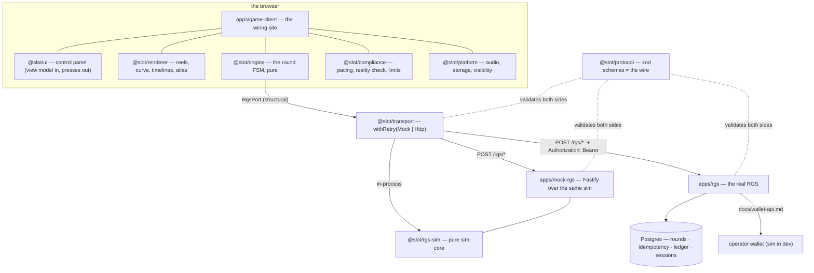

# Architecture

**Status:** written at **C8** (2026-08-20), when every block on the map had landed. This is the
tour for a reader arriving from the README; the maintainer's canon — denser, and updated with
every change — is [`CLAUDE.md`](../CLAUDE.md). Decisions with a story behind them are ADRs in
[`docs/adr/`](adr/).

## The premise

A slot game is two programs that must never trust each other: a server that owns the money and
the outcomes, and a client that owns the feel. Everything in this repository follows from taking
that seriously in both directions — the client cannot decide anything (ADR-0001), and the server
cannot be assumed reachable, honest about latency, or alive between any two calls.

## One diagram

Three properties make the diagram honest rather than aspirational:

- **The contract is executable.** `@slot/protocol` is zod schemas whose inferred types are the
  exported types; both sides of the wire validate against the same objects, so drift is a test
  failure. The contract suite (`tests/contract/`) plays the whole protocol against all three
  servers in the diagram.
- **The boundaries are enforced.** `dependency-cruiser` fails CI on any edge the table in
  `CLAUDE.md` does not allow — `engine` cannot import Pixi, `rgs-sim` cannot import the DOM,
  `apps/rgs` cannot import the simulator it replaces. The rules are themselves tested by fixture
  files that must stay illegal.
- **Purity is linted.** `engine`, `rgs-sim`, `game-math`, `money` and `compliance` ban
  `Math.random()`, ambient time and I/O at lint level; clocks and entropy are injected. A given
  seed replays an identical session, which is what makes the soaks, the RTP report and the E2E
  suite trustworthy.

## The seam, and why swapping servers is configuration

The engine takes an `RgsPort` — four async methods, structurally typed. `MockTransport` runs the
simulator in-process; `HttpTransport` speaks `POST /rgs/<call>` with routes generated from the
protocol's own `CALLS` table, validates every response against the same schemas the server used,
carries the session's bearer token itself (nothing above the transport learns HTTP has headers),
and classifies every failure into the error taxonomy — `RECOVERABLE` (retry, same `roundId`),
`PLAYER` (modal, no retry), `FATAL` (freeze). `withRetry` decorates either transport with one
copy of the backoff rules, honouring a server-sent `retryAfterMs` over its own arithmetic.

The result: which server the game plays is `VITE_RGS_TRANSPORT` plus a base URL. The client code
path is identical; `tests/http.test.ts` plays one round through both transports against
identically seeded simulators and asserts equality field by field.

## The server side, briefly

`packages/rgs-sim` is the specification made executable: pure handlers
`(state, request, context) → (state, response | error)`, a seeded PRNG, the round machine, the
idempotency store, fault injection whose verdicts are themselves seeded. `apps/mock-rgs` is that
core behind a real socket — and since C8 it also serves the built client from `/`, so the deployed
demo is one process on one origin with no CORS anywhere (ADR-0010).

`apps/rgs` is the same contract earned the hard way — the parts a simulator cannot fake:

- **Rounds and idempotency on Postgres**, guarded transitions, insert-only idempotency records,
  one store contract run against the memory and Postgres twins alike (CI runs both).
- **The wallet at the wire** ([`wallet-api.md`](wallet-api.md)): per-attempt deadlines, bounded
  retries made safe by idempotent refs, and a rollback path such that "a wallet failure mid-round
  leaves no orphaned debit" is a test, not a promise.
- **A double-entry ledger** (ADR-0005) that observes and never decides, reconciled against the
  wallet on an interval — including the orphaned stake only a whole-journal scan can find.
- **Provable fairness** (ADR-0006, [`fairness.md`](fairness.md)): per-round seed pairs on a
  CSPRNG chain — commitment before the bet, reveal on the closing response — verifiable with
  `@slot/game-math` alone. Mutually exclusive with `forceOutcome` by construction.
- **Real sessions** (ADR-0007): bearer binding at the transport, a key-guarded operator surface,
  server-side pacing and rate limits in the taxonomy's own error shapes.
- **Observability** (ADR-0008): logs, traces and metrics joined on `roundId`; the money-side
  failures the domain deliberately swallows are made loud at the failure site.
- **Deployability** (ADR-0009, [`deploy.md`](deploy.md)): a two-mode boot contract that refuses
  every dev placeholder in production, one health-gated image, races and restore drills in CI.

## The client side, briefly

The engine is an exhaustive discriminated union driven by a pure reducer — every transition emits
a typed event, inputs illegal in a phase are rejected loudly, and the interruption contract (slam,
skip) is data the renderer implements by completing timelines. The renderer's spin curve is pure
code with tests (exact landings at any frame rate; overshoot and settle); the symbol atlas and
all audio are synthesized at boot, so the repository ships no licensable binary. Compliance rules
arrive **on the wire** (`jurisdictionRules`, D8) and each side enforces what it can observe; the
client adds the reality check (with its exit), the protection picker, autoplay that presses like
a player, i18n under a glyph-coverage test, and a keyboard control panel that shadows the canvas
in the accessibility tree.

Everything meets in `apps/game-client` — the wiring site, deliberately the only file that imports
everything and deliberately free of game rules. Dev affordances (`__DEV_TOOLS__`,
`__ASSERT_MATH__` — the grid/paytable assertions and the fairness audit) are compile-time flags;
`verify:strip` proves the production bundle carries none of it.

## Where to go next

- The wire, call by call: [`protocol.md`](protocol.md)
- A round's life, including every failure path: [`round-lifecycle.md`](round-lifecycle.md)
- Any decision that surprised you: [`adr/`](adr/)
