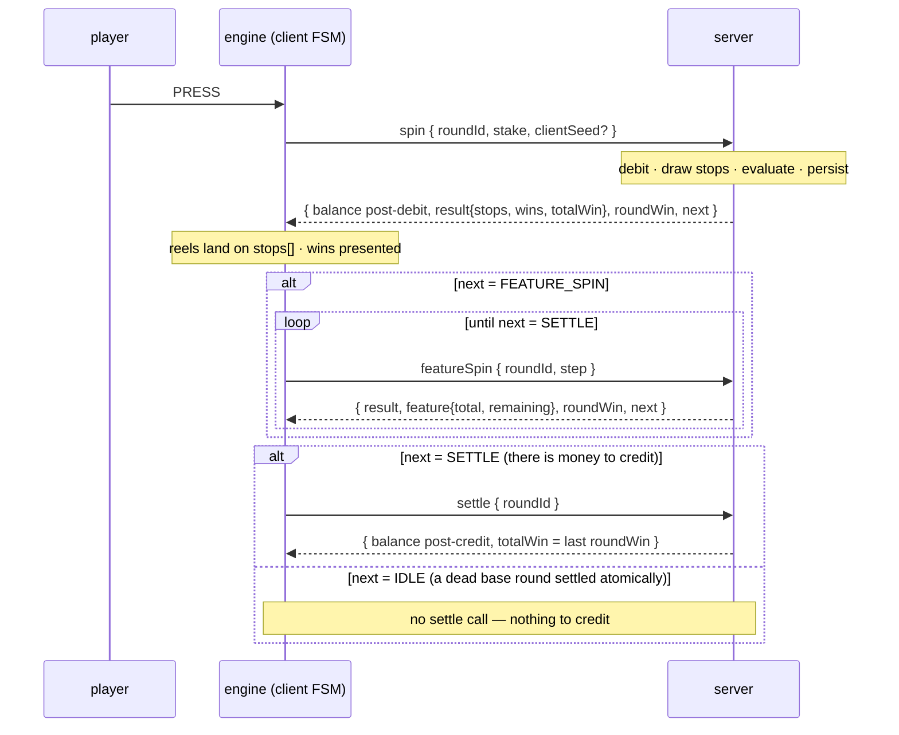
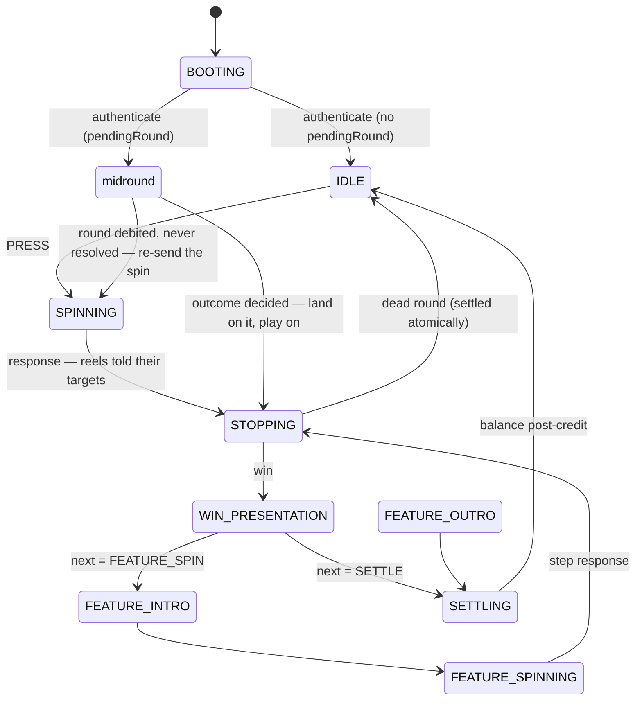

# The life of a round

**Status:** written at **C8** (2026-08-20). The wire itself is pinned in
[`protocol.md`](protocol.md) — this document is the narrative: what happens between the press and
the credit, and what happens when the world misbehaves in the middle of it. Everything below is
enforced by the contract suite against all three servers.

## The invariant

**One round is one stake, one debit and one credit.** Free spins are steps *inside* the round
that paid for them, keyed `(roundId, step)`. The `roundId` is minted by the client (UUIDv7)
before the first request, which is the whole idempotency story: a retry carries the same id, so
the server can prove it is the same round and replay its stored answer instead of spinning again.

## The happy path

Server-side, the round machine is `OPEN → RESOLVED → SETTLED`: a win waits in `RESOLVED` for its
`settle`; a feature holds the round `OPEN` across its steps; a dead base round goes straight to
`SETTLED` on the spin response. Two rules about the numbers: `result.totalWin` is the *math*
(uncapped), `roundWin` is the *money* — the payable total with the max-win ceiling already
applied as the round accrues — and the client never computes a balance: every response carries
the authoritative one, post-operation.

## The client's machine

Inputs a phase cannot service are rejected, never queued — the second spin cannot start while the
first is paying out. A slam or a skip is the engine's decision enacted by the renderer completing
its timelines; skipping and playing out produce an identical state, and that is a test.

## When the world misbehaves

**A lost response.** The transport times out, aborts the socket, and retries **the identical
request** — same `roundId` — under exponential backoff. If the server had executed the call and
only the answer was lost, the idempotency store replays the original bytes: no second debit, no
second outcome. A duplicate that *differs* is refused as `ROUND_CONFLICT`; an honest retry can
never be mistaken for one, because the fingerprint comparison is key-order independent.

**A reload, any time.** Recovery is `authenticate` and nothing else: the response carries
`pendingRound` — the round left open, its decided outcome if one exists, the feature's progress
already folded (`total`, `remaining`). The engine drops into the phase that continues it; the
renderer attaches to a machine already in motion. A reload on free spin 7 of 10 resumes at 7,
and the credit still arrives exactly once — the resume test destroys the client at five points
mid-feature and asserts precisely that.

**A session expiry mid-round** (§5). Every call checks expiry, so the refusal can land between a
debit and its settle. With a round open, the client renews transparently through the lobby seam
and resumes from `pendingRound` — the fresh token re-attaches to the same round. With no round
open it stays a modal; there is deliberately no renew call on the game wire.

**A stranded round.** Only the real RGS can honestly produce it: the wallet debit and the store's
`open` are separate systems, and the process can die between them. `authenticate` then reports
the round with no `result` and no `next` — the schema's one sanctioned absence — and the client's
ordinary spin retry finishes what the crash interrupted. The contract suite's `strand()` runs
this case against `apps/rgs`, where the window is real.

**Errors, by class, not by message.** `RECOVERABLE` retries with the same `roundId`; `PLAYER`
(insufficient funds, stake not allowed, limit reached) is a modal and a return to `IDLE`;
`FATAL` (schema mismatch, round conflict, math-version mismatch) freezes the reels, because
there is no safe way to keep presenting outcomes two sides disagree about. The class is derived
from the code on the client, so a server cannot talk it into retrying the unretryable.

## The pacing and the pause

The jurisdiction travels on the wire. The client holds the spin button for `minSpinIntervalMs`
and the server refuses a spin arriving early (`LIMIT_REACHED`, measured between accepted opens —
replays exempt, free spins never paced: a step inside a round is presentation, not a bet). The
reality check interrupts only on the way into `IDLE` — between rounds, never inside one — and
offers both the way on and the way out; a breached session limit takes the same overlay, minus
the way on.
